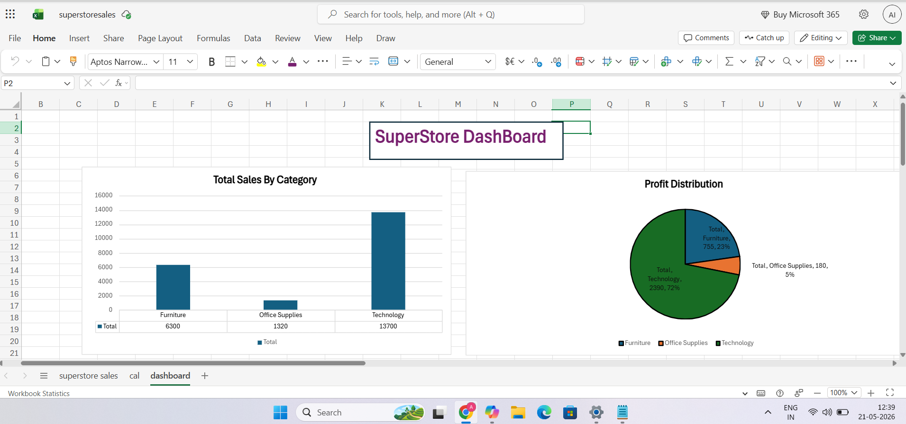
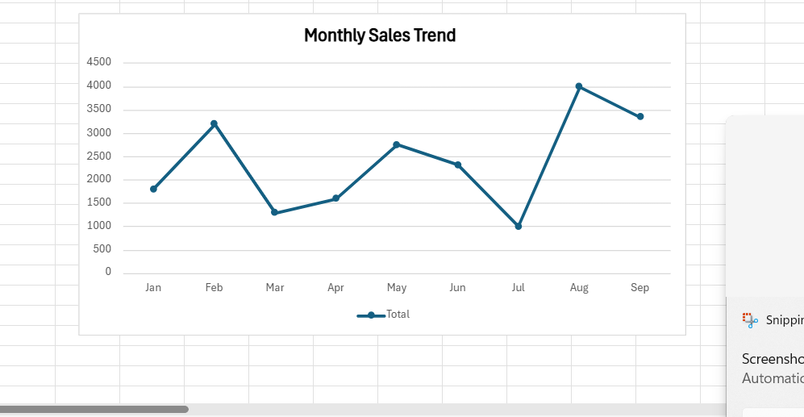

# SCT_DA_01 – Excel Dashboard

## Project Overview
This is an Excel dashboard using the Superstore dataset.  
It shows sales and profit with PivotTables, Charts, and Conditional Formatting.

## Dashboard Preview
### Sales and Profit

### Monthly Sales Trend

## Files
- Superstore_Dashboard.xlsx → Excel dashboard
- README.md → Project notes
- Screenshots → Dashboard visuals

## Insights
- Technology has the highest sales and profit.
- Office Supplies is the lowest performer.
- Sales peak in February and August, dip in July.
## Conclusion
This dashboard makes it easy to see sales and profit trends, helping identify top categories and monthly patterns.
